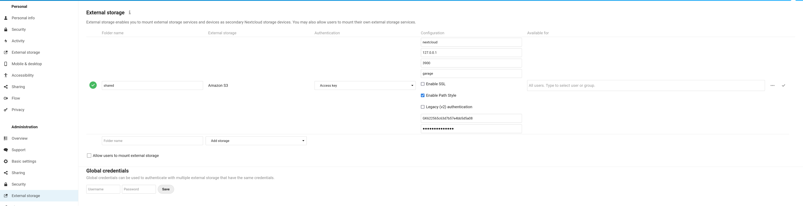

# Apps (Nextcloud, Peertube...)

In this section, we cover the following software: [Nextcloud](#nextcloud), [Peertube](#peertube), [Mastodon](#mastodon), [Matrix](#matrix)

## Nextcloud

Nextcloud is a popular file synchronisation and backup service.
By default, Nextcloud stores its data on the local filesystem.
If you want to expand your storage to aggregate multiple servers, Garage is the way to go.

A S3 backend can be configured in two ways on Nextcloud, either as Primary Storage or as an External Storage.
Primary storage will store all your data on S3, in an opaque manner, and will provide the best performances.
External storage enable you to select which data will be store on S3, you file hierarchy will be preserved in S3, but it might be slower.

In the following, we cover both methods but before reading our guide, we suppose you have done some preliminary steps.
First, we expect you have an already installed and configured Nextcloud instance.
Second, we suppose you have created a key and a bucket.

As a reminder, you can create a key for your nextcloud instance as follow:

```bash
garage key new --name nextcloud-key
```

Keep the Key ID and the Secret key in a pad, they will be needed later.  
Then you can create a bucket and give read/write rights to your key on this bucket with:

```bash
garage bucket create nextcloud
garage bucket allow nextcloud --read --write --key nextcloud-key
```


### Primary Storage

Now edit your Nextcloud configuration file to enable object storage.
On my installation, the config. file is located at the following path: `/var/www/nextcloud/config/config.php`.  
We will add a new root key to the `$CONFIG` dictionnary named `objectstore`:

```php
<?php
$CONFIG = array(
/* your existing configuration */
'objectstore' => [
    'class' => '\\OC\\Files\\ObjectStore\\S3',
    'arguments' => [
        'bucket' => 'nextcloud',   // Your bucket name, must be created before
        'autocreate' => false,     // Garage does not support autocreate
        'key'    => 'xxxxxxxxx',   // The Key ID generated previously
        'secret' => 'xxxxxxxxx',   // The Secret key generated previously
        'hostname' => '127.0.0.1', // Can also be a domain name, eg. garage.example.com
        'port' => 3900,            // Put your reverse proxy port or your S3 API port
        'use_ssl' => false,        // Set it to true if you have a TLS enabled reverse proxy
        'region' => 'garage',      // Garage has only one region named "garage"
        'use_path_style' => true   // Garage supports only path style, must be set to true
    ],
],
```

That's all, your Nextcloud will store all your data to S3.
To test your new configuration, just reload your Nextcloud webpage and start sending data.

*External link:* [Nextcloud Documentation > Primary Storage](https://docs.nextcloud.com/server/latest/admin_manual/configuration_files/primary_storage.html)

### External Storage

**From the GUI.** Activate the "External storage support" app from the "Applications" page (click on your account icon on the top right corner of your screen to display the menu). Go to your parameters page (also located below your account icon). Click on external storage (or the corresponding translation in your language).

[](./cli-nextcloud-gui.png)
*Click on the picture to zoom*

Add a new external storage. Put what you want in "folder name" (eg. "shared"). Select "Amazon S3". Keep "Access Key" for the Authentication field.
In Configuration, put your bucket name (eg. nextcloud), the host (eg. 127.0.0.1), the port (eg. 3900 or 443), the region (garage). Tick the SSL box if you have put an HTTPS proxy in front of garage. You must tick the "Path access" box and you must leave the "Legacy authentication (v2)" box empty. Put your Key ID (eg. GK...) and your Secret Key in the last two input boxes. Finally click on the tick symbol on the right of your screen.

Now go to your "Files" app and a new "linked folder" has appeared with the name you chose earlier (eg. "shared").

*External link:* [Nextcloud Documentation > External Storage Configuration GUI](https://docs.nextcloud.com/server/latest/admin_manual/configuration_files/external_storage_configuration_gui.html)

**From the CLI.** First install the external storage application:

```bash
php occ app:install files_external
```

Then add a new mount point with:

```bash
 php occ files_external:create \
  -c bucket=nextcloud \
  -c hostname=127.0.0.1 \
  -c port=3900 \
  -c region=garage \
  -c use_ssl=false \
  -c use_path_style=true \
  -c legacy_auth=false \
  -c key=GKxxxx \
  -c secret=xxxx \
  shared amazons3 amazons3::accesskey
```

Adapt the `hostname`, `port`, `use_ssl`, `key`, and `secret` entries to your configuration.
Do not change the `use_path_style` and `legacy_auth` entries, other configurations are not supported.

*External link:* [Nextcloud Documentation > occ command > files external](https://docs.nextcloud.com/server/latest/admin_manual/configuration_server/occ_command.html#files-external-label)


## Peertube

https://docs.joinpeertube.org/admin-remote-storage


## Mastodon

https://docs.joinmastodon.org/admin/config/#cdn

## Matrix

### synapse-s3-storage-provider

https://github.com/matrix-org/synapse-s3-storage-provider

### matrix-media-repo

https://github.com/turt2live/matrix-media-repo

## Pixelfed

https://docs.pixelfed.org/technical-documentation/env.html#filesystem

## Pleroma

https://docs-develop.pleroma.social/backend/configuration/cheatsheet/#pleromauploaderss3

## Lemmy

via pict-rs
https://git.asonix.dog/asonix/pict-rs/commit/f9f4fc63d670f357c93f24147c2ee3e1278e2d97

## Funkwhale

https://docs.funkwhale.audio/admin/configuration.html#s3-storage

## Misskey

https://github.com/misskey-dev/misskey/commit/9d944243a3a59e8880a360cbfe30fd5a3ec8d52d

## Prismo

https://gitlab.com/prismosuite/prismo/-/blob/dev/.env.production.sample#L26-33

## Owncloud Infinite Scale (ocis)

## Unsupported

  - Mobilizon: No S3 integration
  - WriteFreely: No S3 integration
  - Plume: No S3 integration
